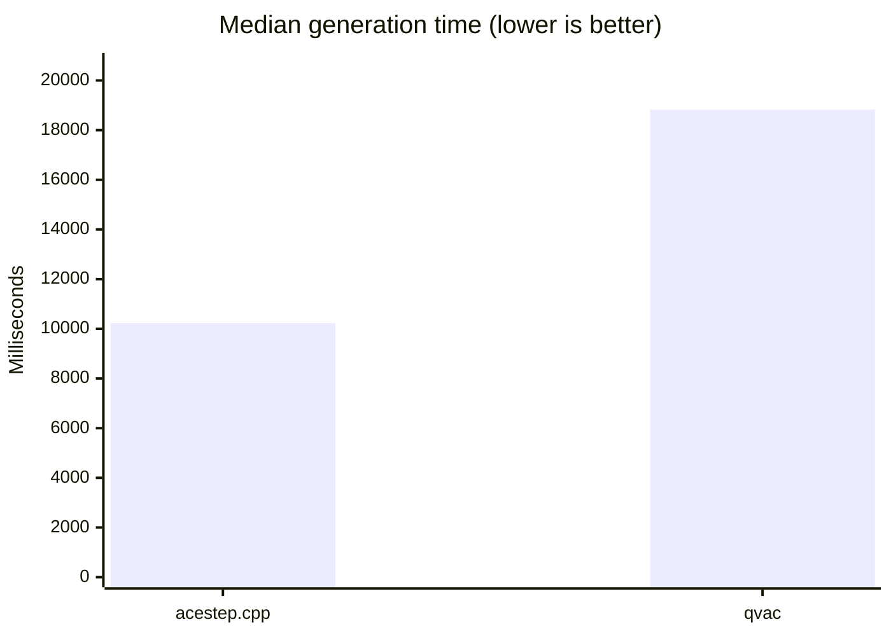
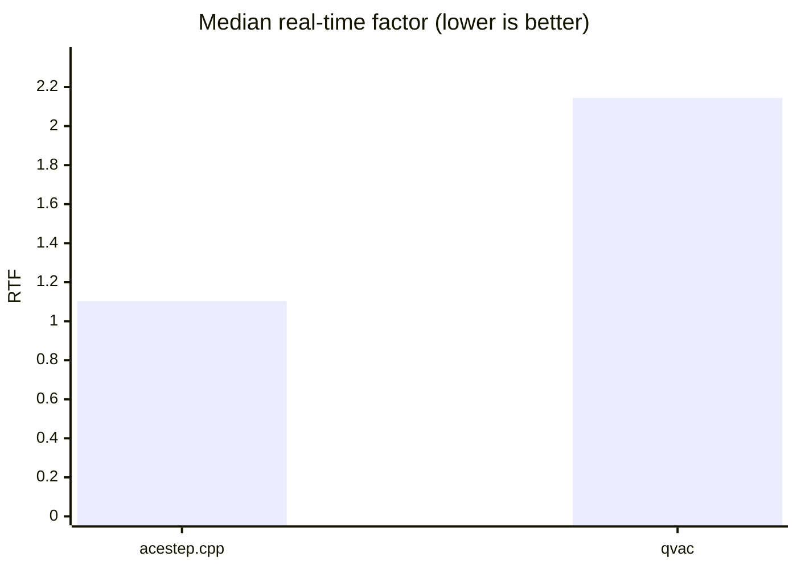
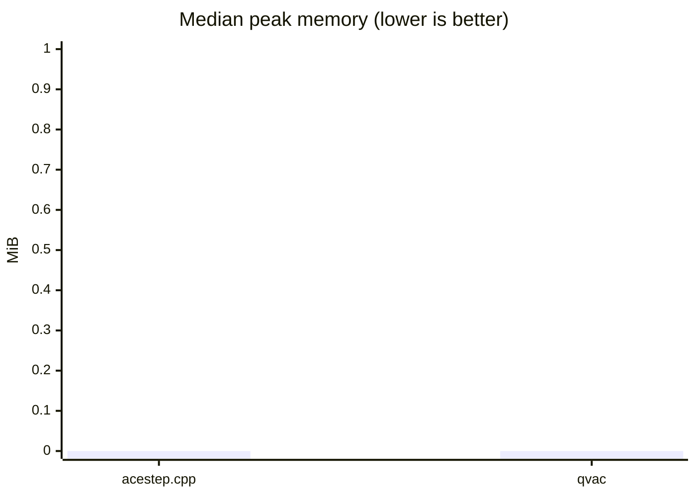
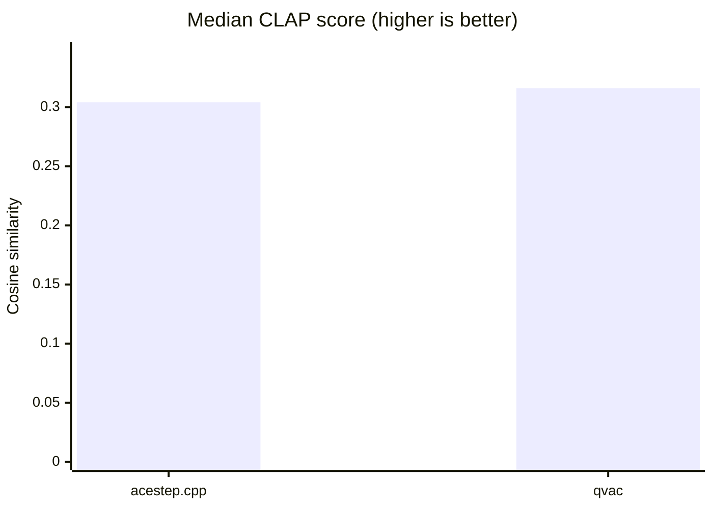
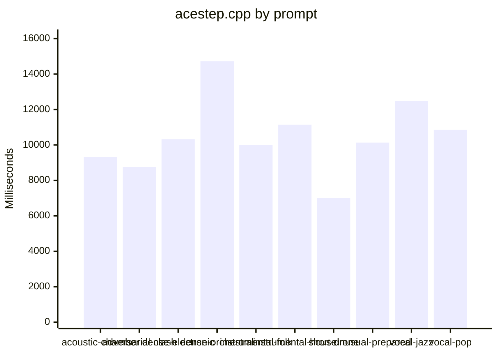
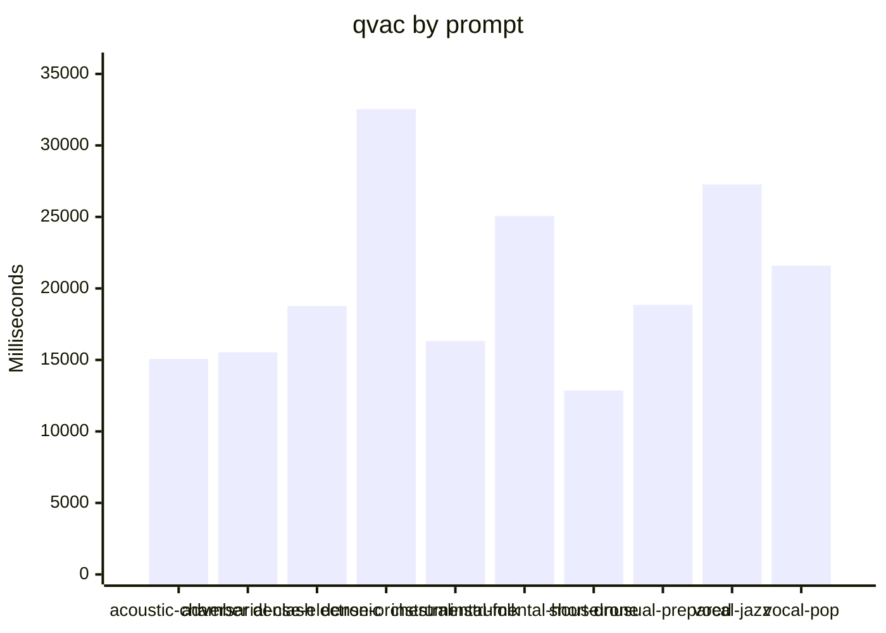

# ACE-Step engine comparison (cpu)

Generated: 2026-08-21T10:24:43.628Z

Comparison class: **implementation-level**. Platform: `linux-x64`. Threads: 4. Warm-ups: 1. Timed runs: 3. Order: `alternate`. Cooldown: 5000 ms.

Both engines used the same GGUF files, prompt manifest, duration, seed, LM sampling defaults, Euler sampler, and Haar DCW double-mode scalers. QVAC `music-cli` is a single process. `acestep.cpp` is `ace-lm` then `ace-synth`. QVAC lazy-loads stages inside `generate()`; acestep.cpp loads modules in each CLI process.

## Overall

| Engine | Success | Fail | Median gen ms | Median e2e ms | Median RTF | Peak RSS | Unique WAV hashes | Silent | Median CLAP |
|---|---:|---:|---:|---:|---:|---:|---:|---:|---:|
| acestep.cpp | 30 | 0 | 10233.3 | 10233.3 | 1.103 | n/a | 10 | 0 | 0.304 |
| qvac | 30 | 0 | 18826.0 | 19035.7 | 2.144 | n/a | 10 | 0 | 0.316 |

## Visualizations

### Median generation time by prompt

## acoustic-chamber

| Engine | Success | Fail | Median gen ms | Median e2e ms | Median RTF | Peak RSS | Unique WAV hashes | Silent | Median CLAP |
|---|---:|---:|---:|---:|---:|---:|---:|---:|---:|
| acestep.cpp | 3 | 0 | 9313.0 | 9313.0 | 1.164 | n/a | 1 | 0 | 0.369 |
| qvac | 3 | 0 | 15069.0 | 15276.0 | 2.093 | n/a | 1 | 0 | 0.292 |

## adversarial-clash

| Engine | Success | Fail | Median gen ms | Median e2e ms | Median RTF | Peak RSS | Unique WAV hashes | Silent | Median CLAP |
|---|---:|---:|---:|---:|---:|---:|---:|---:|---:|
| acestep.cpp | 3 | 0 | 8762.0 | 8762.0 | 1.217 | n/a | 1 | 0 | 0.241 |
| qvac | 3 | 0 | 15535.0 | 15736.2 | 2.158 | n/a | 1 | 0 | 0.249 |

## dense-electronic

| Engine | Success | Fail | Median gen ms | Median e2e ms | Median RTF | Peak RSS | Unique WAV hashes | Silent | Median CLAP |
|---|---:|---:|---:|---:|---:|---:|---:|---:|---:|
| acestep.cpp | 3 | 0 | 10322.5 | 10322.5 | 1.093 | n/a | 1 | 0 | 0.440 |
| qvac | 3 | 0 | 18762.0 | 18967.8 | 2.039 | n/a | 1 | 0 | 0.340 |

## dense-orchestral

| Engine | Success | Fail | Median gen ms | Median e2e ms | Median RTF | Peak RSS | Unique WAV hashes | Silent | Median CLAP |
|---|---:|---:|---:|---:|---:|---:|---:|---:|---:|
| acestep.cpp | 3 | 0 | 14725.1 | 14725.1 | 0.969 | n/a | 1 | 0 | 0.216 |
| qvac | 3 | 0 | 32540.0 | 32758.0 | 2.141 | n/a | 1 | 0 | 0.447 |

## instrumental-folk

| Engine | Success | Fail | Median gen ms | Median e2e ms | Median RTF | Peak RSS | Unique WAV hashes | Silent | Median CLAP |
|---|---:|---:|---:|---:|---:|---:|---:|---:|---:|
| acestep.cpp | 3 | 0 | 9985.6 | 9985.6 | 1.342 | n/a | 1 | 0 | 0.266 |
| qvac | 3 | 0 | 16325.0 | 16525.3 | 2.082 | n/a | 1 | 0 | 0.254 |

## instrumental-house

| Engine | Success | Fail | Median gen ms | Median e2e ms | Median RTF | Peak RSS | Unique WAV hashes | Silent | Median CLAP |
|---|---:|---:|---:|---:|---:|---:|---:|---:|---:|
| acestep.cpp | 3 | 0 | 11144.6 | 11144.6 | 1.088 | n/a | 1 | 0 | 0.522 |
| qvac | 3 | 0 | 25062.0 | 25271.5 | 2.191 | n/a | 1 | 0 | 0.556 |

## short-drone

| Engine | Success | Fail | Median gen ms | Median e2e ms | Median RTF | Peak RSS | Unique WAV hashes | Silent | Median CLAP |
|---|---:|---:|---:|---:|---:|---:|---:|---:|---:|
| acestep.cpp | 3 | 0 | 7006.7 | 7006.7 | 1.347 | n/a | 1 | 0 | 0.071 |
| qvac | 3 | 0 | 12865.0 | 13065.7 | 2.144 | n/a | 1 | 0 | 0.257 |

## unusual-prepared

| Engine | Success | Fail | Median gen ms | Median e2e ms | Median RTF | Peak RSS | Unique WAV hashes | Silent | Median CLAP |
|---|---:|---:|---:|---:|---:|---:|---:|---:|---:|
| acestep.cpp | 3 | 0 | 10132.7 | 10132.7 | 1.101 | n/a | 1 | 0 | 0.272 |
| qvac | 3 | 0 | 18855.0 | 19058.6 | 2.049 | n/a | 1 | 0 | 0.238 |

## vocal-jazz

| Engine | Success | Fail | Median gen ms | Median e2e ms | Median RTF | Peak RSS | Unique WAV hashes | Silent | Median CLAP |
|---|---:|---:|---:|---:|---:|---:|---:|---:|---:|
| acestep.cpp | 3 | 0 | 12478.4 | 12478.4 | 1.019 | n/a | 1 | 0 | 0.376 |
| qvac | 3 | 0 | 27274.0 | 27492.8 | 2.228 | n/a | 1 | 0 | 0.363 |

## vocal-pop

| Engine | Success | Fail | Median gen ms | Median e2e ms | Median RTF | Peak RSS | Unique WAV hashes | Silent | Median CLAP |
|---|---:|---:|---:|---:|---:|---:|---:|---:|---:|
| acestep.cpp | 3 | 0 | 10850.9 | 10850.9 | 1.085 | n/a | 1 | 0 | 0.588 |
| qvac | 3 | 0 | 21591.0 | 21799.4 | 2.159 | n/a | 1 | 0 | 0.570 |

Failed rounds are retained in the JSON. WAV QC and optional CLAP scores are computed from files after generation and are not included in generation time or RTF.
