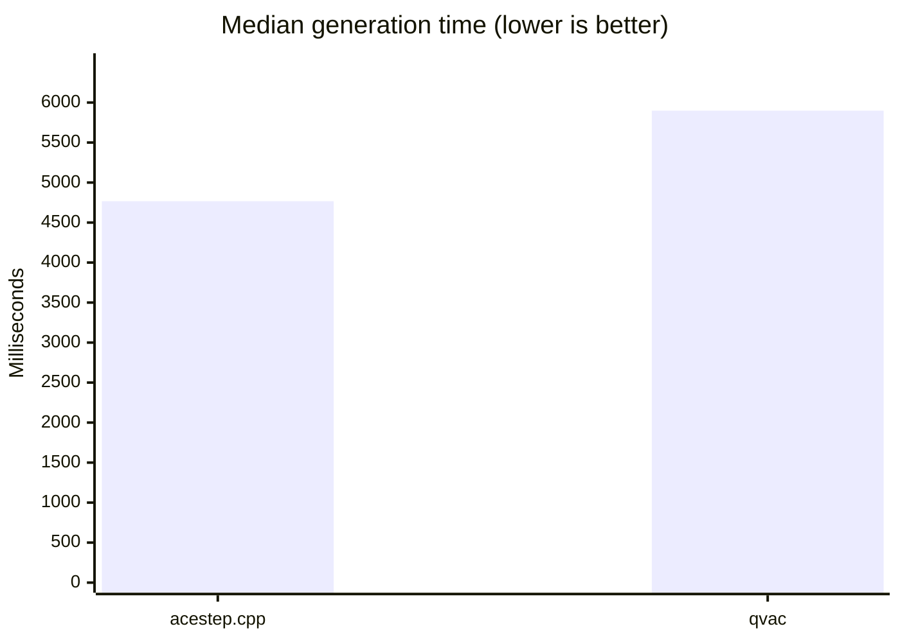
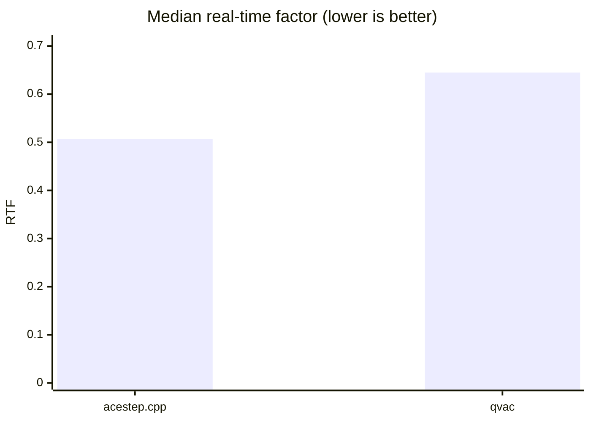
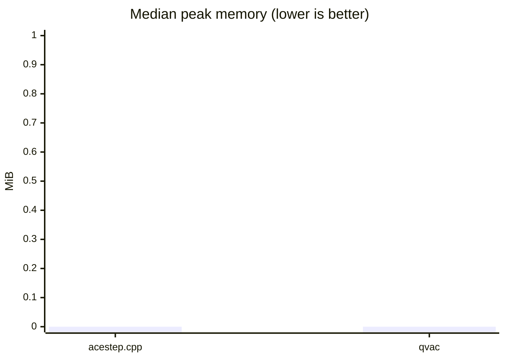
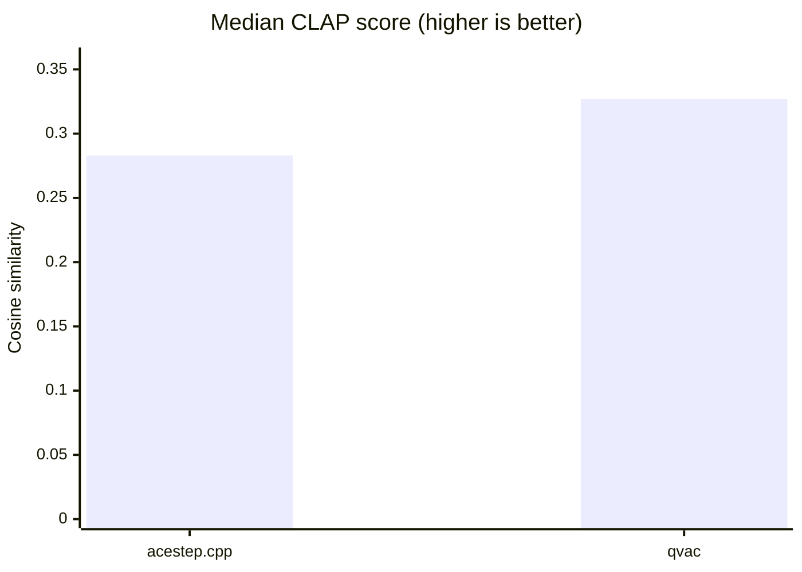
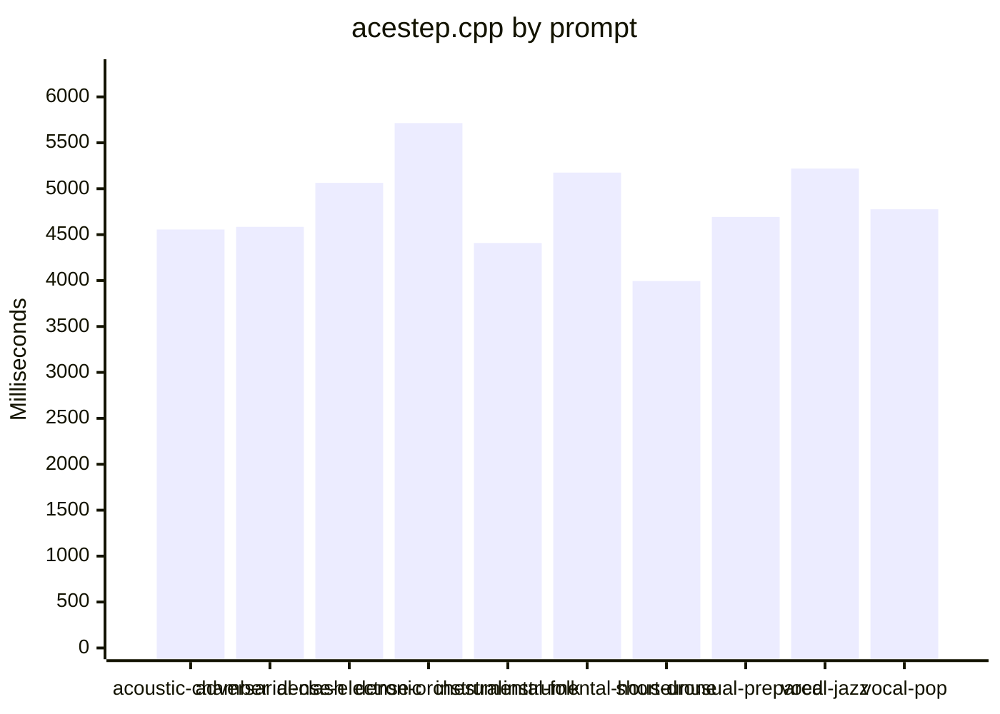
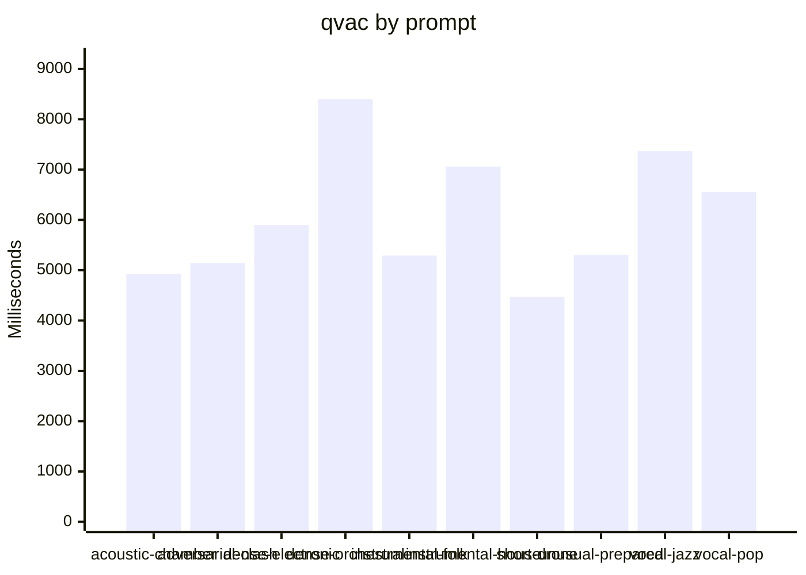

# ACE-Step engine comparison (vulkan)

Generated: 2026-08-21T10:28:14.254Z

Comparison class: **implementation-level**. Platform: `linux-x64`. Threads: 4. Warm-ups: 1. Timed runs: 3. Order: `alternate`. Cooldown: 5000 ms.

Both engines used the same GGUF files, prompt manifest, duration, seed, LM sampling defaults, Euler sampler, and Haar DCW double-mode scalers. QVAC `music-cli` is a single process. `acestep.cpp` is `ace-lm` then `ace-synth`. QVAC lazy-loads stages inside `generate()`; acestep.cpp loads modules in each CLI process.

## Overall

| Engine | Success | Fail | Median gen ms | Median e2e ms | Median RTF | Peak RSS | Unique WAV hashes | Silent | Median CLAP |
|---|---:|---:|---:|---:|---:|---:|---:|---:|---:|
| acestep.cpp | 30 | 0 | 4766.9 | 4766.9 | 0.507 | n/a | 10 | 0 | 0.283 |
| qvac | 30 | 0 | 5898.5 | 6183.2 | 0.645 | n/a | 10 | 0 | 0.327 |

## Visualizations

### Median generation time by prompt

## acoustic-chamber

| Engine | Success | Fail | Median gen ms | Median e2e ms | Median RTF | Peak RSS | Unique WAV hashes | Silent | Median CLAP |
|---|---:|---:|---:|---:|---:|---:|---:|---:|---:|
| acestep.cpp | 3 | 0 | 4555.9 | 4555.9 | 0.599 | n/a | 1 | 0 | 0.223 |
| qvac | 3 | 0 | 4928.0 | 5198.3 | 0.684 | n/a | 1 | 0 | 0.287 |

## adversarial-clash

| Engine | Success | Fail | Median gen ms | Median e2e ms | Median RTF | Peak RSS | Unique WAV hashes | Silent | Median CLAP |
|---|---:|---:|---:|---:|---:|---:|---:|---:|---:|
| acestep.cpp | 3 | 0 | 4584.5 | 4584.5 | 0.637 | n/a | 1 | 0 | 0.205 |
| qvac | 3 | 0 | 5146.0 | 5394.6 | 0.715 | n/a | 1 | 0 | 0.257 |

## dense-electronic

| Engine | Success | Fail | Median gen ms | Median e2e ms | Median RTF | Peak RSS | Unique WAV hashes | Silent | Median CLAP |
|---|---:|---:|---:|---:|---:|---:|---:|---:|---:|
| acestep.cpp | 3 | 0 | 5063.5 | 5063.5 | 0.506 | n/a | 1 | 0 | 0.430 |
| qvac | 3 | 0 | 5900.0 | 6188.7 | 0.641 | n/a | 1 | 0 | 0.331 |

## dense-orchestral

| Engine | Success | Fail | Median gen ms | Median e2e ms | Median RTF | Peak RSS | Unique WAV hashes | Silent | Median CLAP |
|---|---:|---:|---:|---:|---:|---:|---:|---:|---:|
| acestep.cpp | 3 | 0 | 5714.7 | 5714.7 | 0.376 | n/a | 1 | 0 | 0.223 |
| qvac | 3 | 0 | 8400.0 | 8697.0 | 0.553 | n/a | 1 | 0 | 0.435 |

## instrumental-folk

| Engine | Success | Fail | Median gen ms | Median e2e ms | Median RTF | Peak RSS | Unique WAV hashes | Silent | Median CLAP |
|---|---:|---:|---:|---:|---:|---:|---:|---:|---:|
| acestep.cpp | 3 | 0 | 4408.8 | 4408.8 | 0.593 | n/a | 1 | 0 | 0.318 |
| qvac | 3 | 0 | 5291.0 | 5539.2 | 0.675 | n/a | 1 | 0 | 0.236 |

## instrumental-house

| Engine | Success | Fail | Median gen ms | Median e2e ms | Median RTF | Peak RSS | Unique WAV hashes | Silent | Median CLAP |
|---|---:|---:|---:|---:|---:|---:|---:|---:|---:|
| acestep.cpp | 3 | 0 | 5175.4 | 5175.4 | 0.462 | n/a | 1 | 0 | 0.510 |
| qvac | 3 | 0 | 7060.0 | 7332.0 | 0.617 | n/a | 1 | 0 | 0.578 |

## short-drone

| Engine | Success | Fail | Median gen ms | Median e2e ms | Median RTF | Peak RSS | Unique WAV hashes | Silent | Median CLAP |
|---|---:|---:|---:|---:|---:|---:|---:|---:|---:|
| acestep.cpp | 3 | 0 | 3994.8 | 3994.8 | 0.713 | n/a | 1 | 0 | 0.015 |
| qvac | 3 | 0 | 4474.0 | 4736.4 | 0.746 | n/a | 1 | 0 | 0.322 |

## unusual-prepared

| Engine | Success | Fail | Median gen ms | Median e2e ms | Median RTF | Peak RSS | Unique WAV hashes | Silent | Median CLAP |
|---|---:|---:|---:|---:|---:|---:|---:|---:|---:|
| acestep.cpp | 3 | 0 | 4692.6 | 4692.6 | 0.489 | n/a | 1 | 0 | 0.258 |
| qvac | 3 | 0 | 5305.0 | 5568.6 | 0.577 | n/a | 1 | 0 | 0.185 |

## vocal-jazz

| Engine | Success | Fail | Median gen ms | Median e2e ms | Median RTF | Peak RSS | Unique WAV hashes | Silent | Median CLAP |
|---|---:|---:|---:|---:|---:|---:|---:|---:|---:|
| acestep.cpp | 3 | 0 | 5219.5 | 5219.5 | 0.450 | n/a | 1 | 0 | 0.317 |
| qvac | 3 | 0 | 7364.0 | 7638.6 | 0.602 | n/a | 1 | 0 | 0.382 |

## vocal-pop

| Engine | Success | Fail | Median gen ms | Median e2e ms | Median RTF | Peak RSS | Unique WAV hashes | Silent | Median CLAP |
|---|---:|---:|---:|---:|---:|---:|---:|---:|---:|
| acestep.cpp | 3 | 0 | 4775.8 | 4775.8 | 0.506 | n/a | 1 | 0 | 0.555 |
| qvac | 3 | 0 | 6551.0 | 6818.6 | 0.655 | n/a | 1 | 0 | 0.555 |

Failed rounds are retained in the JSON. WAV QC and optional CLAP scores are computed from files after generation and are not included in generation time or RTF.
