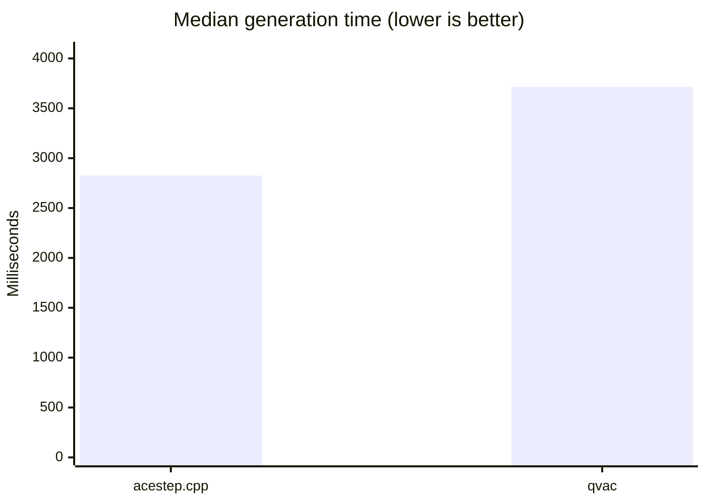
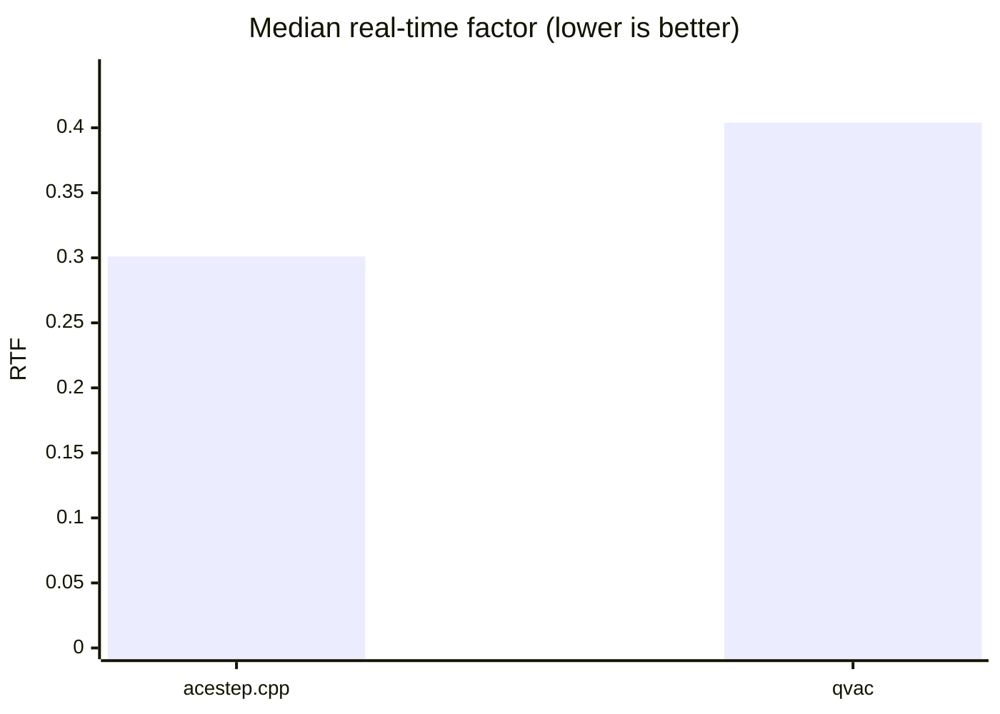
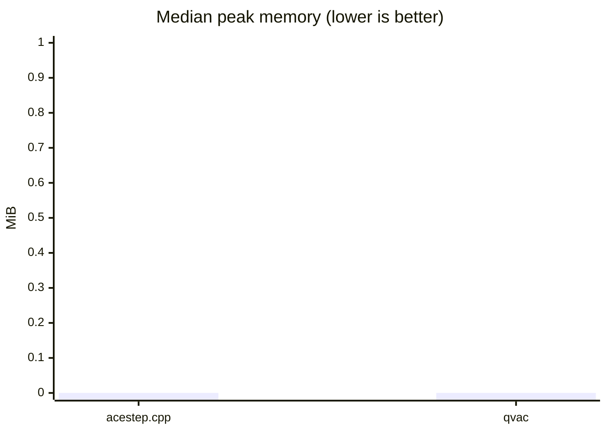
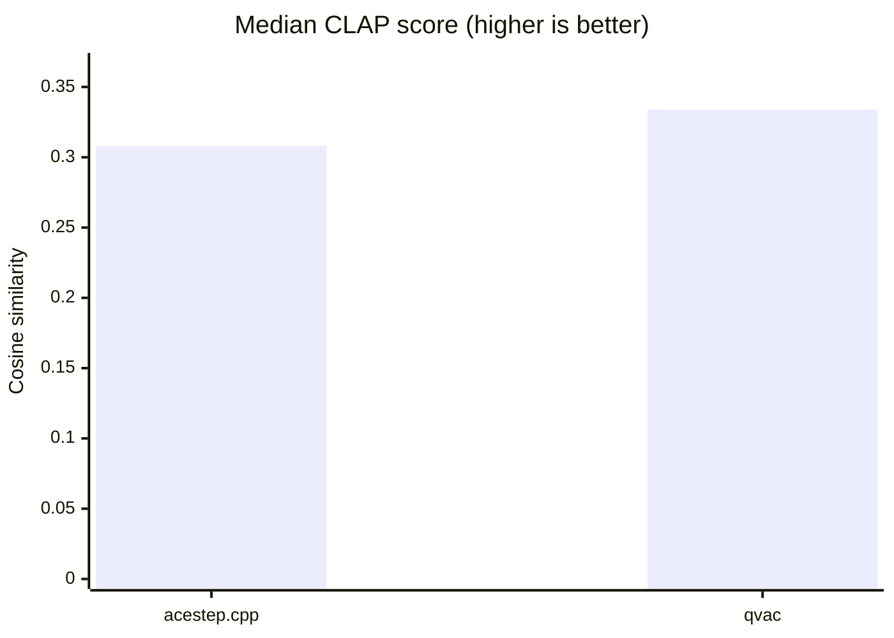
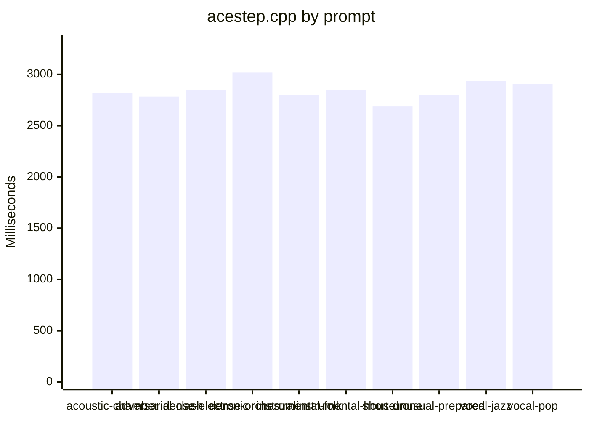
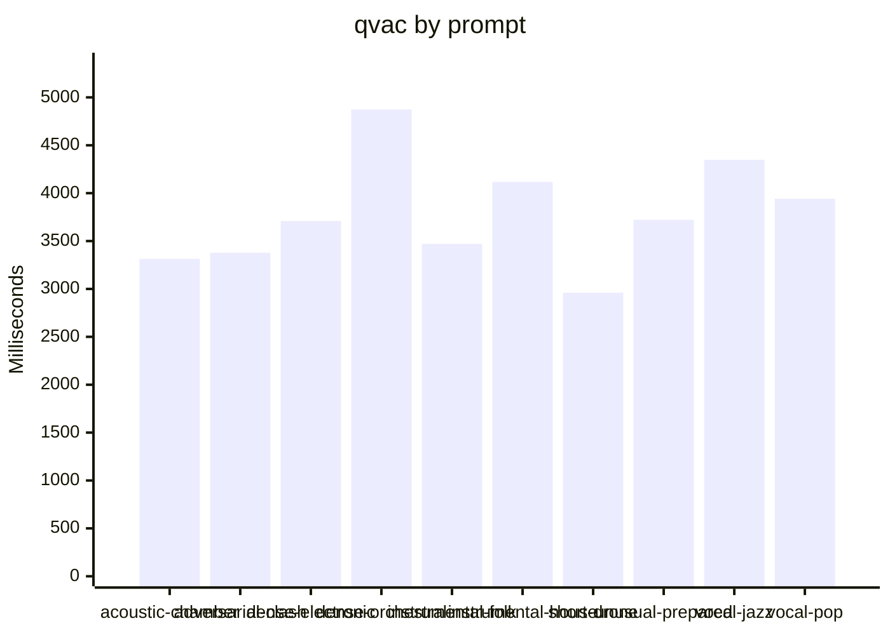

# ACE-Step engine comparison (cuda)

Generated: 2026-08-24T07:18:03.143Z

Comparison class: **implementation-level**. Platform: `linux-x64`. Threads: 4. Warm-ups: 1. Timed runs: 3. Order: `alternate`. Cooldown: 5000 ms.

Both engines used the same GGUF files, prompt manifest, duration, seed, LM sampling defaults, Euler sampler, and Haar DCW double-mode scalers. QVAC `music-cli` is a single process. `acestep.cpp` is `ace-lm` then `ace-synth`. QVAC lazy-loads stages inside `generate()`; acestep.cpp loads modules in each CLI process.

## Overall

| Engine | Success | Fail | Median gen ms | Median e2e ms | Median RTF | Peak RSS | Unique WAV hashes | Silent | Median CLAP |
|---|---:|---:|---:|---:|---:|---:|---:|---:|---:|
| acestep.cpp | 30 | 0 | 2826.0 | 2826.0 | 0.301 | n/a | 10 | 0 | 0.308 |
| qvac | 30 | 0 | 3715.0 | 4284.9 | 0.404 | n/a | 10 | 0 | 0.334 |

## Visualizations

### Median generation time by prompt

## acoustic-chamber

| Engine | Success | Fail | Median gen ms | Median e2e ms | Median RTF | Peak RSS | Unique WAV hashes | Silent | Median CLAP |
|---|---:|---:|---:|---:|---:|---:|---:|---:|---:|
| acestep.cpp | 3 | 0 | 2822.6 | 2822.6 | 0.379 | n/a | 1 | 0 | 0.285 |
| qvac | 3 | 0 | 3314.0 | 3893.3 | 0.460 | n/a | 1 | 0 | 0.273 |

## adversarial-clash

| Engine | Success | Fail | Median gen ms | Median e2e ms | Median RTF | Peak RSS | Unique WAV hashes | Silent | Median CLAP |
|---|---:|---:|---:|---:|---:|---:|---:|---:|---:|
| acestep.cpp | 3 | 0 | 2783.0 | 2783.0 | 0.387 | n/a | 1 | 0 | 0.184 |
| qvac | 3 | 0 | 3377.0 | 3962.2 | 0.469 | n/a | 1 | 0 | 0.227 |

## dense-electronic

| Engine | Success | Fail | Median gen ms | Median e2e ms | Median RTF | Peak RSS | Unique WAV hashes | Silent | Median CLAP |
|---|---:|---:|---:|---:|---:|---:|---:|---:|---:|
| acestep.cpp | 3 | 0 | 2847.2 | 2847.2 | 0.309 | n/a | 1 | 0 | 0.321 |
| qvac | 3 | 0 | 3709.0 | 4275.6 | 0.403 | n/a | 1 | 0 | 0.311 |

## dense-orchestral

| Engine | Success | Fail | Median gen ms | Median e2e ms | Median RTF | Peak RSS | Unique WAV hashes | Silent | Median CLAP |
|---|---:|---:|---:|---:|---:|---:|---:|---:|---:|
| acestep.cpp | 3 | 0 | 3018.3 | 3018.3 | 0.199 | n/a | 1 | 0 | 0.287 |
| qvac | 3 | 0 | 4874.0 | 5438.3 | 0.321 | n/a | 1 | 0 | 0.448 |

## instrumental-folk

| Engine | Success | Fail | Median gen ms | Median e2e ms | Median RTF | Peak RSS | Unique WAV hashes | Silent | Median CLAP |
|---|---:|---:|---:|---:|---:|---:|---:|---:|---:|
| acestep.cpp | 3 | 0 | 2800.2 | 2800.2 | 0.376 | n/a | 1 | 0 | 0.296 |
| qvac | 3 | 0 | 3470.0 | 4050.9 | 0.443 | n/a | 1 | 0 | 0.232 |

## instrumental-house

| Engine | Success | Fail | Median gen ms | Median e2e ms | Median RTF | Peak RSS | Unique WAV hashes | Silent | Median CLAP |
|---|---:|---:|---:|---:|---:|---:|---:|---:|---:|
| acestep.cpp | 3 | 0 | 2848.8 | 2848.8 | 0.246 | n/a | 1 | 0 | 0.399 |
| qvac | 3 | 0 | 4117.0 | 4687.2 | 0.360 | n/a | 1 | 0 | 0.516 |

## short-drone

| Engine | Success | Fail | Median gen ms | Median e2e ms | Median RTF | Peak RSS | Unique WAV hashes | Silent | Median CLAP |
|---|---:|---:|---:|---:|---:|---:|---:|---:|---:|
| acestep.cpp | 3 | 0 | 2690.9 | 2690.9 | 0.448 | n/a | 1 | 0 | 0.318 |
| qvac | 3 | 0 | 2961.0 | 3534.8 | 0.493 | n/a | 1 | 0 | 0.387 |

## unusual-prepared

| Engine | Success | Fail | Median gen ms | Median e2e ms | Median RTF | Peak RSS | Unique WAV hashes | Silent | Median CLAP |
|---|---:|---:|---:|---:|---:|---:|---:|---:|---:|
| acestep.cpp | 3 | 0 | 2799.5 | 2799.5 | 0.292 | n/a | 1 | 0 | 0.300 |
| qvac | 3 | 0 | 3721.0 | 4294.2 | 0.404 | n/a | 1 | 0 | 0.273 |

## vocal-jazz

| Engine | Success | Fail | Median gen ms | Median e2e ms | Median RTF | Peak RSS | Unique WAV hashes | Silent | Median CLAP |
|---|---:|---:|---:|---:|---:|---:|---:|---:|---:|
| acestep.cpp | 3 | 0 | 2935.8 | 2935.8 | 0.245 | n/a | 1 | 0 | 0.313 |
| qvac | 3 | 0 | 4349.0 | 4931.6 | 0.355 | n/a | 1 | 0 | 0.378 |

## vocal-pop

| Engine | Success | Fail | Median gen ms | Median e2e ms | Median RTF | Peak RSS | Unique WAV hashes | Silent | Median CLAP |
|---|---:|---:|---:|---:|---:|---:|---:|---:|---:|
| acestep.cpp | 3 | 0 | 2908.4 | 2908.4 | 0.280 | n/a | 1 | 0 | 0.595 |
| qvac | 3 | 0 | 3942.0 | 4513.8 | 0.394 | n/a | 1 | 0 | 0.566 |

Failed rounds are retained in the JSON. WAV QC and optional CLAP scores are computed from files after generation and are not included in generation time or RTF.
