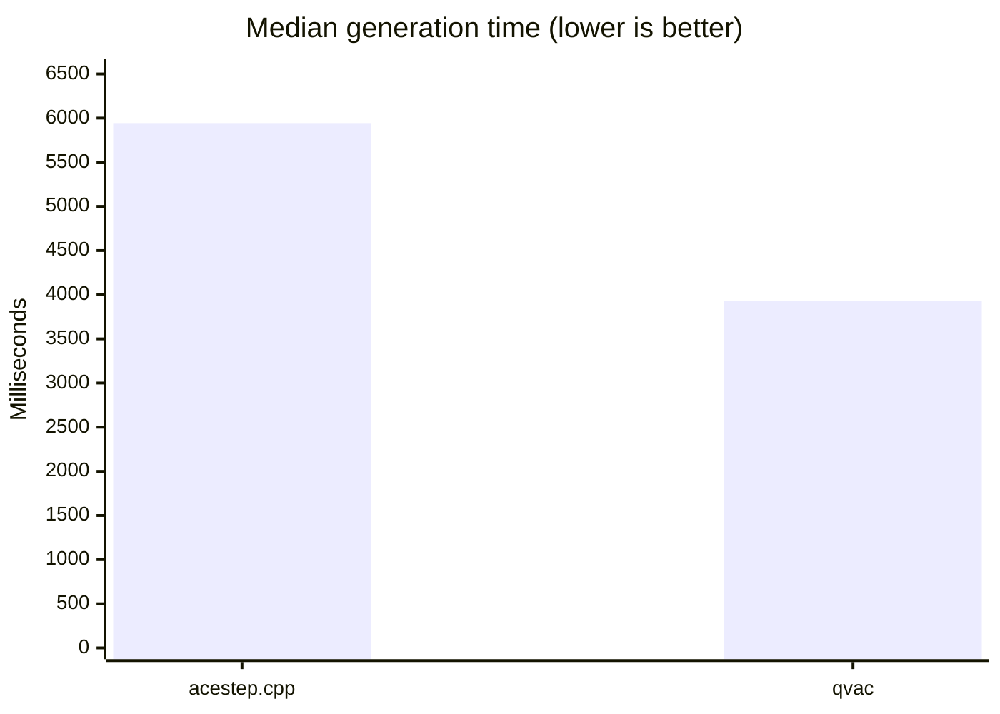
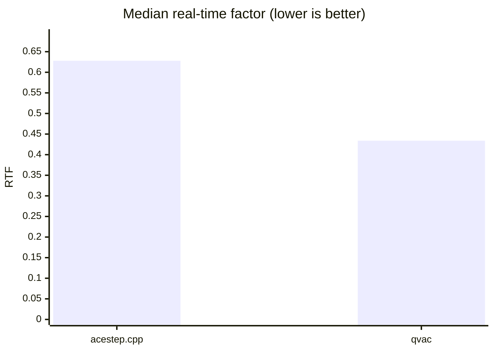
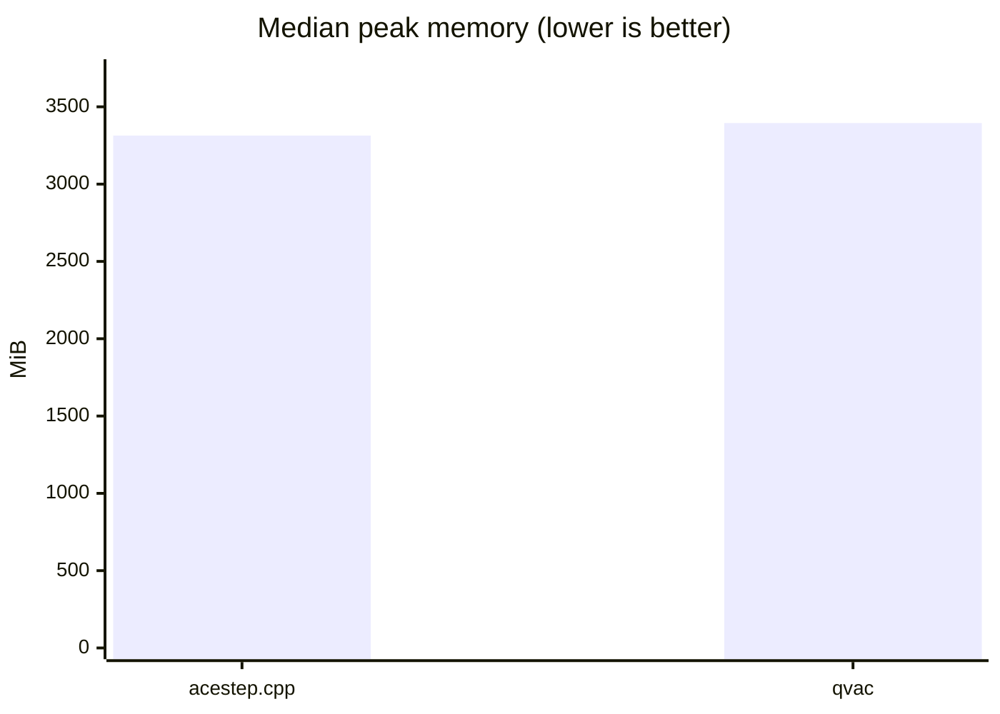
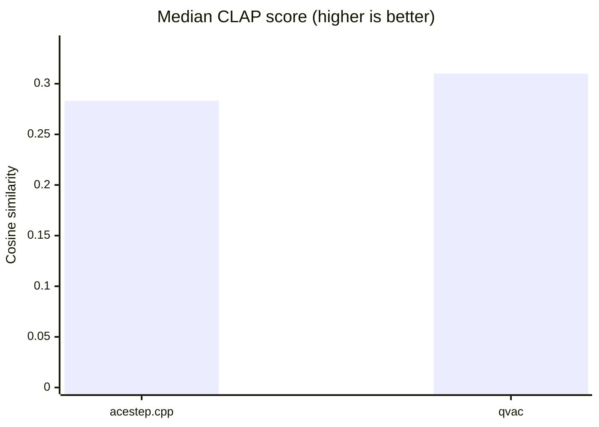
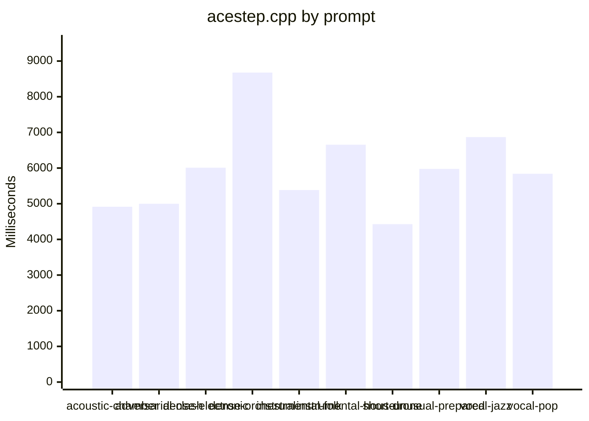
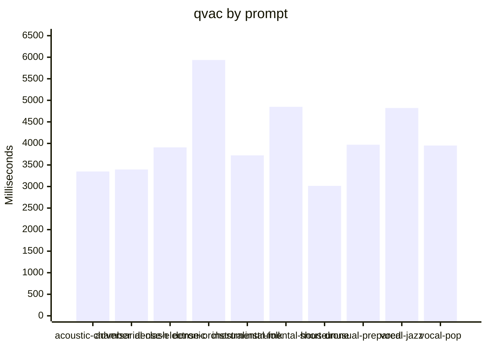

# ACE-Step engine comparison (metal)

Generated: 2026-08-20T09:06:00.682Z

Comparison class: **implementation-level**. Platform: `darwin-arm64`. Threads: 4. Warm-ups: 1. Timed runs: 3. Order: `alternate`. Cooldown: 5000 ms.

Both engines used the same GGUF files, prompt manifest, duration, seed, LM sampling defaults, Euler sampler, and Haar DCW double-mode scalers. QVAC `music-cli` is a single process. `acestep.cpp` is `ace-lm` then `ace-synth`. QVAC lazy-loads stages inside `generate()`; acestep.cpp loads modules in each CLI process.

## Overall

| Engine | Success | Fail | Median gen ms | Median e2e ms | Median RTF | Peak RSS | Unique WAV hashes | Silent | Median CLAP |
|---|---:|---:|---:|---:|---:|---:|---:|---:|---:|
| acestep.cpp | 30 | 0 | 5943.7 | 5943.7 | 0.628 | 3314.3 MiB | 10 | 0 | 0.283 |
| qvac | 30 | 0 | 3931.0 | 4439.6 | 0.434 | 3394.8 MiB | 10 | 0 | 0.310 |

## Visualizations

### Median generation time by prompt

## acoustic-chamber

| Engine | Success | Fail | Median gen ms | Median e2e ms | Median RTF | Peak RSS | Unique WAV hashes | Silent | Median CLAP |
|---|---:|---:|---:|---:|---:|---:|---:|---:|---:|
| acestep.cpp | 3 | 0 | 4916.3 | 4916.3 | 0.683 | 3310.6 MiB | 1 | 0 | 0.268 |
| qvac | 3 | 0 | 3349.0 | 3681.0 | 0.465 | 3392.5 MiB | 1 | 0 | 0.212 |

## adversarial-clash

| Engine | Success | Fail | Median gen ms | Median e2e ms | Median RTF | Peak RSS | Unique WAV hashes | Silent | Median CLAP |
|---|---:|---:|---:|---:|---:|---:|---:|---:|---:|
| acestep.cpp | 3 | 0 | 4999.6 | 4999.6 | 0.694 | 3317.2 MiB | 1 | 0 | 0.187 |
| qvac | 3 | 0 | 3396.0 | 3652.9 | 0.472 | 3395.3 MiB | 1 | 0 | 0.190 |

## dense-electronic

| Engine | Success | Fail | Median gen ms | Median e2e ms | Median RTF | Peak RSS | Unique WAV hashes | Silent | Median CLAP |
|---|---:|---:|---:|---:|---:|---:|---:|---:|---:|
| acestep.cpp | 3 | 0 | 6009.8 | 6009.8 | 0.611 | 3313.3 MiB | 1 | 0 | 0.408 |
| qvac | 3 | 0 | 3908.0 | 4166.7 | 0.425 | 3392.4 MiB | 1 | 0 | 0.378 |

## dense-orchestral

| Engine | Success | Fail | Median gen ms | Median e2e ms | Median RTF | Peak RSS | Unique WAV hashes | Silent | Median CLAP |
|---|---:|---:|---:|---:|---:|---:|---:|---:|---:|
| acestep.cpp | 3 | 0 | 8677.6 | 8677.6 | 0.556 | 3312.4 MiB | 1 | 0 | 0.474 |
| qvac | 3 | 0 | 5936.0 | 6208.5 | 0.391 | 3398.2 MiB | 1 | 0 | 0.306 |

## instrumental-folk

| Engine | Success | Fail | Median gen ms | Median e2e ms | Median RTF | Peak RSS | Unique WAV hashes | Silent | Median CLAP |
|---|---:|---:|---:|---:|---:|---:|---:|---:|---:|
| acestep.cpp | 3 | 0 | 5383.7 | 5383.7 | 0.673 | 3320.3 MiB | 1 | 0 | 0.224 |
| qvac | 3 | 0 | 3723.0 | 4189.6 | 0.465 | 3394.5 MiB | 1 | 0 | 0.310 |

## instrumental-house

| Engine | Success | Fail | Median gen ms | Median e2e ms | Median RTF | Peak RSS | Unique WAV hashes | Silent | Median CLAP |
|---|---:|---:|---:|---:|---:|---:|---:|---:|---:|
| acestep.cpp | 3 | 0 | 6655.6 | 6655.6 | 0.594 | 3313.2 MiB | 1 | 0 | 0.370 |
| qvac | 3 | 0 | 4850.0 | 5212.4 | 0.418 | 3391.8 MiB | 1 | 0 | 0.453 |

## short-drone

| Engine | Success | Fail | Median gen ms | Median e2e ms | Median RTF | Peak RSS | Unique WAV hashes | Silent | Median CLAP |
|---|---:|---:|---:|---:|---:|---:|---:|---:|---:|
| acestep.cpp | 3 | 0 | 4427.5 | 4427.5 | 0.791 | 3319.0 MiB | 1 | 0 | -0.011 |
| qvac | 3 | 0 | 3015.0 | 3686.2 | 0.538 | 3394.9 MiB | 1 | 0 | 0.008 |

## unusual-prepared

| Engine | Success | Fail | Median gen ms | Median e2e ms | Median RTF | Peak RSS | Unique WAV hashes | Silent | Median CLAP |
|---|---:|---:|---:|---:|---:|---:|---:|---:|---:|
| acestep.cpp | 3 | 0 | 5975.3 | 5975.3 | 0.622 | 3318.6 MiB | 1 | 0 | 0.283 |
| qvac | 3 | 0 | 3971.0 | 4702.9 | 0.414 | 3394.5 MiB | 1 | 0 | 0.362 |

## vocal-jazz

| Engine | Success | Fail | Median gen ms | Median e2e ms | Median RTF | Peak RSS | Unique WAV hashes | Silent | Median CLAP |
|---|---:|---:|---:|---:|---:|---:|---:|---:|---:|
| acestep.cpp | 3 | 0 | 6868.2 | 6868.2 | 0.592 | 3320.5 MiB | 1 | 0 | 0.274 |
| qvac | 3 | 0 | 4821.0 | 5207.3 | 0.430 | 3396.8 MiB | 1 | 0 | 0.244 |

## vocal-pop

| Engine | Success | Fail | Median gen ms | Median e2e ms | Median RTF | Peak RSS | Unique WAV hashes | Silent | Median CLAP |
|---|---:|---:|---:|---:|---:|---:|---:|---:|---:|
| acestep.cpp | 3 | 0 | 5841.2 | 5841.2 | 0.635 | 3313.3 MiB | 1 | 0 | 0.561 |
| qvac | 3 | 0 | 3951.0 | 4693.8 | 0.437 | 3396.7 MiB | 1 | 0 | 0.470 |

Failed rounds are retained in the JSON. WAV QC and optional CLAP scores are computed from files after generation and are not included in generation time or RTF.
